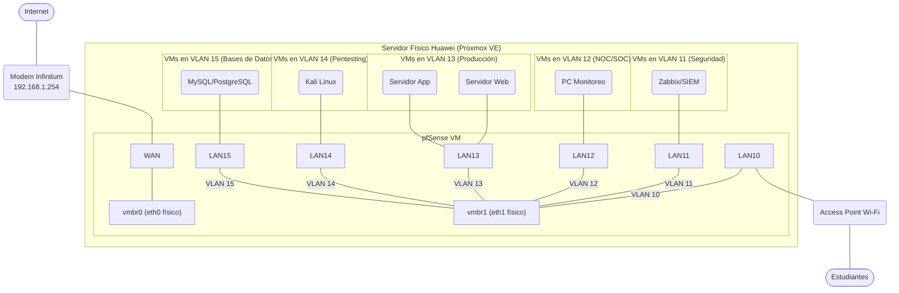

# Proyecto: Diseño e Implementación de Infraestructura de Red Segura y Segmentada para Laboratorio de Ciberseguridad

**Versión:** 1.0
**Fecha:** 2025-10-14
**Autor:** [Tu Nombre Completo]
**Revisor:** [Nombre de tu Asesor/Profesor]

---

## 1. Resumen Ejecutivo

Este proyecto detalla el diseño, implementación y gestión de una infraestructura de red robusta, segmentada y segura sobre una plataforma de virtualización Proxmox VE. El objetivo es crear un entorno de laboratorio avanzado para la especialidad de informática, capaz de simular redes corporativas y militares de alta demanda, facilitando la formación práctica en defensa, ataque (pentesting), monitoreo (NOC/SOC) y gestión de servicios críticos. La arquitectura se centra en el uso de un firewall pfSense para la segmentación lógica a través de VLANs, garantizando el aislamiento de redes y la aplicación de políticas de seguridad granulares. El resultado final será una plataforma resiliente, documentada y escalable, lista para ser presentada a la alta dirección del instituto como un modelo de laboratorio de ciberseguridad de próxima generación.

---

## 2. Objetivos del Proyecto

### 2.1. Objetivo Principal
Implementar una infraestructura de red virtualizada, segura y multi-segmentada que sirva como laboratorio práctico para la especialidad de informática, siguiendo las mejores prácticas de la industria y estándares de alta seguridad.

### 2.2. Objetivos Específicos
- **Configurar el entorno de virtualización:** Instalar y asegurar el hipervisor Proxmox VE en el servidor físico Huawei.
- **Desplegar el Firewall Perimetral:** Virtualizar e instalar pfSense como el firewall central y router de la infraestructura.
- **Establecer la Segmentación de Red:** Crear y configurar 6 VLANs distintas para aislar el tráfico de estudiantes, servicios de seguridad, operaciones, servidores productivos, atacantes y bases de datos.
- **Implementar Políticas de Seguridad:** Definir y aplicar reglas de firewall estrictas entre las VLANs para controlar el flujo de tráfico y asegurar el principio de mínimo privilegio.
- **Habilitar Servicios de Red:** Configurar servicios esenciales como DHCP y DNS para las redes internas a través de pfSense.
- **Validar la Arquitectura:** Realizar pruebas de conectividad y penetración controladas desde la red de atacantes (LAN 14) para verificar la efectividad de los controles de seguridad.
- **Crear Documentación Exhaustiva:** Documentar cada fase del proyecto, incluyendo diagramas de red, procedimientos de configuración, políticas de seguridad y un plan de respuesta a incidentes.

---

## 3. Alcance del Proyecto

### 3.1. Dentro del Alcance (In-Scope)
- Configuración del servidor Proxmox VE y su red física.
- Instalación y configuración completa de la VM pfSense.
- Creación de todas las VLANs y puentes de red necesarios en Proxmox y pfSense.
- Definición de reglas de firewall para el tráfico inter-VLAN.
- Despliegue de al menos una máquina virtual de prueba en cada VLAN para validar la configuración.
- Documentación técnica del proyecto en este repositorio de GitHub.

### 3.2. Fuera del Alcance (Out-of-Scope)
- Configuración de aplicaciones específicas dentro de las máquinas virtuales (ej. instalación de un SIEM específico, configuración de un servidor web Apache).
- Gestión y configuración del Access Point Wi-Fi más allá de conectarlo a la interfaz LAN física.
- Adquisición de hardware o licencias de software adicionales.
- Soporte técnico a largo plazo de la infraestructura post-entrega del proyecto.

---

## 4. Arquitectura Propuesta

### 4.1. Diagrama Lógico de la Red

### 4.2. Esquema de Direccionamiento IP y VLANs

| ID VLAN | Red      | Nombre             | Gateway (pfSense IP) | Rango de Red         | Máscara de Subred | Propósito                                              |
|---------|----------|--------------------|----------------------|----------------------|-------------------|--------------------------------------------------------|
| **N/A** | WAN      | Internet (Infinitum) | `192.168.1.254`      | `192.168.1.0/24`     | `255.255.255.0`   | Conexión de salida a Internet.                         |
| **10** | LAN 10   | Red de Estudiantes | `172.20.10.254`      | `172.20.10.0/24`     | `255.255.255.0`   | Conexión Wi-Fi para usuarios finales.                  |
| **11** | LAN 11   | Servicios Seguridad  | `172.20.11.254`      | `172.20.11.0/24`     | `255.255.255.0`   | VMs con herramientas de seguridad (SIEM, IDS/IPS, etc).|
| **12** | LAN 12   | NOC / SOC          | `172.20.12.254`      | `172.20.12.0/24`     | `255.255.255.0`   | VMs para el personal de monitoreo y operaciones.       |
| **13** | LAN 13   | Servidores Prod.   | `172.20.13.254`      | `172.20.13.0/24`     | `255.255.255.0`   | Servidores que ofrecen servicios (Web, Apps).          |
| **14** | LAN 14   | Red de Atacantes   | `172.20.14.254`      | `172.20.14.0/24`     | `255.255.255.0`   | VMs para realizar pruebas de pentesting.               |
| **15** | LAN 15   | Bases de Datos     | `172.20.15.254`      | `172.20.15.0/24`     | `255.255.255.0`   | Servidores de bases de datos, red altamente restringida.|

---

## 5. Plan de Trabajo (Work Breakdown Structure - WBS)

A continuación se presenta el plan de trabajo detallado, paso a paso.

### **Fase 1: Configuración del Entorno de Virtualización (Proxmox)**
- **1.1.** Instalación limpia de Proxmox VE en el servidor Huawei.
- **1.2.** Configuración de red inicial de Proxmox.
    - Asignar la IP estática `192.168.1.90` a la interfaz de gestión (`vmbr0`) conectada al puerto físico 1 (`eth0`).
    - Verificar la conectividad a Internet y el acceso a la interfaz web de Proxmox.
- **1.3.** Crear un segundo Linux Bridge (`vmbr1`) sin dirección IP, asociado al puerto físico 2 (`eth1`) y con la opción "VLAN aware" activada. Este será el Trunk para todas las VLANs internas.
- **1.4.** Subir la imagen ISO de pfSense al almacenamiento local de Proxmox.

### **Fase 2: Despliegue y Configuración del Firewall (pfSense)**
- **2.1.** Crear una nueva máquina virtual para pfSense.
    - **Hardware:** 2 vCPU, 2 GB RAM, 32 GB Disco.
    - **Red:** Asignar dos interfaces de red virtuales:
        - `net0` conectada a `vmbr0` (Será la WAN).
        - `net1` conectada a `vmbr1` (Será el Trunk de las LANs).
- **2.2.** Instalar pfSense desde la ISO.
- **2.3.** Configuración inicial de interfaces en la consola de pfSense:
    - Asignar la interfaz `vtnet0` como WAN (obtendrá IP por DHCP de la red `192.168.1.0/24` o se configurará estáticamente).
    - Asignar la interfaz `vtnet1` como LAN. Se le puede dar una IP temporal (ej. `192.168.100.1/24`) para el acceso inicial a la GUI web.
- **2.4.** Primer acceso a la GUI web de pfSense y completar el asistente de configuración.
- **2.5.** Crear las VLANs en pfSense (Interfaces > Assignments > VLANs):
    - Crear VLAN 10, 11, 12, 13, 14, 15, todas sobre `vtnet1`.
- **2.6.** Asignar las VLANs a nuevas interfaces lógicas (Interfaces > Assignments):
    - Crear una interfaz para cada VLAN (ej. `LAN10`, `LAN11`, etc.).
    - Configurar la IP estática correspondiente para cada interfaz (ej. `172.20.10.254/24` para `LAN10`).
- **2.7.** Configurar los servicios DHCP Server para cada interfaz LAN que lo requiera (principalmente `LAN10`, `LAN12`, `LAN14`).

### **Fase 3: Implementación de Reglas de Firewall**
- **3.1.** Establecer una regla por defecto de "Denegar todo" (Default Deny) en cada interfaz LAN.
- **3.2.** Crear reglas explícitas para permitir el tráfico necesario (Principio de Mínimo Privilegio). Ejemplos:
    - **LAN10 (Estudiantes):** Permitir salida a Internet (puertos 80, 443). Bloquear todo acceso a las otras LANs internas.
    - **LAN14 (Atacantes):** Permitir acceso controlado a `LAN13` (Servidores) solo en puertos específicos para las pruebas. Bloquear el resto.
    - **LAN13 (Servidores):** Permitir el acceso desde `LAN12` (NOC/SOC) para gestión. Permitir el acceso desde `LAN13` a `LAN15` (Bases de Datos) solo en el puerto de la base de datos (ej. 3306).
    - **LAN15 (Bases de Datos):** Bloquear toda la salida a Internet. Solo permitir conexiones entrantes desde `LAN13`.
- **3.3.** Configurar Aliases en pfSense para agrupar IPs, puertos o redes y simplificar la gestión de reglas.

### **Fase 4: Creación de VMs de Prueba y Validación**
- **4.1.** Crear al menos una VM por cada VLAN en Proxmox.
- **4.2.** Al crear la VM, en la configuración de red, asociar su interfaz de red a `vmbr1` y especificar el "VLAN Tag" correspondiente (ej. `10` para la VM de estudiantes, `13` para el servidor web, etc.).
- **4.3.** Verificar que cada VM obtenga una IP del rango correcto a través del DHCP de pfSense (si está configurado) o configurarla manualmente.
- **4.4.** Realizar pruebas de conectividad (ping, traceroute) para validar que las reglas del firewall funcionan como se espera.

### **Fase 5: Documentación y Presentación**
- **5.1.** Actualizar este archivo `README.md` con capturas de pantalla de las configuraciones clave.
- **5.2.** Crear documentos adicionales en el repositorio:
    - `POLITICAS_DE_RED.md`: Descripción detallada de cada regla de firewall y su justificación.
    - `PLAN_DE_RESPUESTA_A_INCIDENTES.md`: Procedimiento a seguir en caso de una brecha de seguridad simulada.
    - `PROCEDIMIENTOS_OPERATIVOS.md`: Guías para tareas comunes como agregar una nueva VM o modificar una regla de firewall.
- **5.3.** Preparar una presentación ejecutiva para la alta dirección resumiendo el proyecto, sus beneficios y la arquitectura implementada.

---

## 6. Consideraciones "Radar" (Visión 360°)

Para elevar el proyecto a un nivel de "cumplimiento militar", se deben considerar los siguientes aspectos:

### **Tecnología**
- **Monitoreo y Logging:** Instalar paquetes en pfSense como `pfBlockerNG` para bloqueo de IPs maliciosas y `Suricata` o `Snort` para Detección/Prevención de Intrusiones (IDS/IPS). Centralizar los logs de pfSense y de las VMs en un servidor SIEM (Security Information and Event Management) como Wazuh o un stack ELK en la `LAN11`.
- **Gestión de Vulnerabilidades:** Desplegar un escáner como OpenVAS o Nessus en la `LAN11` para escanear periódicamente los servidores de la `LAN13` en busca de vulnerabilidades.
- **Backup y Recuperación:** Utilizar Proxmox Backup Server (puede ser otra VM) para programar respaldos automáticos y cifrados de todas las máquinas virtuales críticas.
- **Hardening:** Aplicar guías de fortalecimiento (hardening) tanto para el host Proxmox como para los sistemas operativos de las VMs (ej. CIS Benchmarks).

### **Procesos**
- **Gestión de Cambios:** Documentar cualquier cambio en la configuración de red o de firewall en un "log de cambios" dentro de este repositorio. Cualquier modificación debe ser solicitada, aprobada y documentada.
- **Principio de Mínimo Privilegio:** No solo aplicarlo a las reglas de red, sino también a las cuentas de usuario. Crear roles de usuario específicos en Proxmox y en las VMs.
- **Auditoría:** Planificar auditorías periódicas de las reglas del firewall y las configuraciones de seguridad para asegurar que siguen siendo relevantes y efectivas.

### **Personas**
- **Roles y Responsabilidades:** Definir claramente quién es responsable de qué (aunque seas solo tú, define los roles): Administrador de Red, Oficial de Seguridad, Analista SOC.
- **Concienciación y Formación:** Crear una breve "Política de Uso Aceptable" para los usuarios de la `LAN10` (Estudiantes), explicando qué está y qué no está permitido.
- **Plan de Comunicación:** Definir cómo se comunicarán las alertas de seguridad generadas por el SIEM o IDS al equipo responsable (Analista SOC).

---

## 7. Cronograma Estimado

| Fase                                                  | Duración Estimada |
|-------------------------------------------------------|-------------------|
| Fase 1: Configuración de Proxmox                      | 2 Días            |
| Fase 2: Despliegue y Configuración de pfSense         | 3 Días            |
| Fase 3: Implementación de Reglas de Firewall          | 3 Días            |
| Fase 4: Creación de VMs de Prueba y Validación        | 2 Días            |
| Fase 5: Documentación y Preparación de la Presentación | 4 Días            |
| **Total Estimado** | **14 Días** |

## 8. Gobernanza y Plan de Colaboración Holístico

Este documento establece el marco de colaboración y la asignación de responsabilidades para el proyecto de infraestructura segura, integrando las capacidades del grupo de la especialidad de **Informática (Infraestructura y Servicios)** y del grupo de la **Maestría en Seguridad (Defensa y Operaciones)**.

### 8.1. Visión Holística y Roles de los Grupos

-   **Grupo de Informática (Equipos 1-4): "Los Arquitectos y Constructores"** 🏗️
    -   **Misión:** Diseñar, construir y mantener la infraestructura de red, cómputo y almacenamiento. Su enfoque es la **disponibilidad, rendimiento y funcionalidad** de la plataforma sobre la cual operarán los servicios y los controles de seguridad. Son responsables de las capas 1 a 4 del modelo OSI y de las plataformas de virtualización y sistemas operativos.

-   **Grupo de Maestría en Seguridad (Equipos 1-3): "Los Guardianes y Analistas"** 🛡️
    -   **Misión:** Asegurar, monitorear y defender la infraestructura y los servicios construidos por el grupo de Informática. Su enfoque es la **confidencialidad, integridad y resiliencia** del entorno. Son responsables de implementar y operar las herramientas de seguridad avanzada (capas 5 a 7), analizar eventos y responder a incidentes.

### 8.2. Modelo de Colaboración

* **Coordinadores de Proyecto:** Un representante de la especialidad (líder del Equipo 1 de Informática) y un representante de la maestría actuarán como puntos de contacto principales para sincronizar los esfuerzos.
* **Reuniones de Sincronización (Sync-up):** Se llevarán a cabo reuniones semanales cortas con los líderes de los 7 equipos para reportar avances, identificar bloqueos y planificar las siguientes acciones.
* **Repositorio Centralizado:** El repositorio de GitHub será la única fuente de verdad para toda la documentación, scripts de configuración (`IaC - Infrastructure as Code`), y el seguimiento de tareas (`issues`).
* **Principio de Dependencia:** Se reconoce que las tareas de la maestría dependen directamente de la correcta implementación de la infraestructura base por parte de los equipos de la especialidad.

---

### 8.3. Plan de Trabajo por Fases y Asignación de Equipos

El proyecto se divide en cuatro fases lógicas. Cada equipo tiene un rol protagónico en diferentes momentos, pero la colaboración es constante.

#### **FASE 1: Construcción de la Infraestructura Fundamental (Core Infrastructure)**
* **Objetivo:** Establecer el entorno de virtualización, la red troncal y la segmentación lógica.
* **Líder de Fase:** Equipo de Informática 1.

| Equipo | Responsabilidades Principales en Fase 1 |
| :--- | :--- |
| **Informática 1 (Redes)** | 🔵 **(Protagónico)** Configuración del host Proxmox, creación de Linux Bridges (vmbr0, vmbr1). Despliegue y configuración completa de pfSense: interfaces WAN/LAN, creación de todas las VLANs (10-15), asignación de IPs, configuración de DHCP y DNS. Establecimiento de las reglas de firewall base (política de denegación por defecto). |
| **Informática 2-4** | ⚪ **(Soporte)** Validar el esquema de direccionamiento IP y los requerimientos de conectividad para sus futuras VMs. |
| **Maestría 1-3** | ⚪ **(Consultor)** Revisar la arquitectura de red desde una perspectiva de seguridad. Validar que la segmentación propuesta cumple con los requisitos para el despliegue de sus herramientas. |

---

#### **FASE 2: Despliegue de Servicios y Cargas de Trabajo (Service Deployment)**
* **Objetivo:** Poblar la infraestructura con las máquinas virtuales que simularán un entorno productivo y de pruebas.
* **Líder de Fase:** Coordinador de Informática.

| Equipo | Responsabilidades Principales en Fase 2 |
| :--- | :--- |
| **Informática 1 (Redes)** | 🟡 **(Soporte Activo)** Crear las VMs en Proxmox según las especificaciones de los demás equipos. Asignar correctamente el VLAN Tag a cada VM. Ajustar reglas de firewall a demanda para permitir la instalación y configuración inicial. |
| **Informática 2 (Servidores)** | 🔵 **(Protagónico)** Desplegar y configurar las VMs de servidores productivos en la **LAN 13** (ej. Servidor Web, App Server). Realizar el hardening básico del SO. |
| **Informática 3 (Bases de Datos)**| 🔵 **(Protagónico)** Desplegar y configurar las VMs de bases de datos en la **LAN 15** (ej. MySQL, PostgreSQL). Configurar usuarios y permisos iniciales. |
| **Informática 4 (Red Team)** | 🔵 **(Protagónico)** Desplegar y configurar las VMs de ataque en la **LAN 14** (ej. Kali Linux, Parrot OS). Instalar las herramientas para las pruebas. |
| **Maestría 1-3** | ⚪ **(Observador)** Preparar los agentes y configuraciones de sus herramientas para la siguiente fase. |

---

#### **FASE 3: Implementación de Controles de Seguridad Avanzados (Security Overlay)**
* **Objetivo:** Instrumentar la infraestructura con las herramientas de monitoreo, detección y respuesta.
* **Líder de Fase:** Coordinador de la Maestría en Seguridad.

| Equipo | Responsabilidades Principales en Fase 3 |
| :--- | :--- |
| **Informática 1 (Redes)** | 🟡 **(Soporte Activo)** Instalar los paquetes solicitados en pfSense (Suricata, etc.). Implementar las reglas de firewall complejas y Port Forwarding para el Reverse Proxy y WAF, siguiendo indicaciones de Maestría 1. |
| **Informática 2, 3, 4** | 🟡 **(Soporte Activo)** Instalar los agentes de Wazuh en todas sus VMs, con el apoyo de Maestría 2. |
| **Maestría 1 (Defensa Perimetral)**| 🔵 **(Protagónico)** Configurar el **IDS/IPS (Suricata)** en pfSense. Desplegar y configurar un **Reverse Proxy** y un **Web Application Firewall (WAF)** para proteger LAN 13. Desplegar **Honeypot**. |
| **Maestría 2 (SOC/XDR)** | 🔵 **(Protagónico)** Desplegar el servidor **Wazuh** en la **LAN 12**. Gestionar el registro de agentes, configurar políticas de monitoreo y crear dashboards. |
| **Maestría 3 (MDR/IR)** | 🔵 **(Protagónico)** Desplegar la plataforma de respuesta a incidentes en la **LAN 11**: **TheHive**, **Cortex** y **MISP**. Integrar estas herramientas con Wazuh. |

---

#### **FASE 4: Integración, Pruebas de Batalla y Operación (Integration & Battle Testing)**
* **Objetivo:** Validar la arquitectura completa a través de un ejercicio de Red Team vs. Blue Team.
* **Líder de Fase:** Ambos coordinadores.

| Equipo | Responsabilidades Principales en Fase 4 |
| :--- | :--- |
| **Informática 1 (Redes)** | 🟡 **(Blue Team)** Monitorear el tráfico de red en pfSense y los logs del firewall. Colaborar para identificar y bloquear actividad maliciosa a nivel de red. |
| **Informática 2-3 (Servicios)** | 🟡 **(Blue Team)** Monitorear el estado de sus aplicaciones y bases de datos. Reportar anomalías y aplicar parches recomendados. |
| **Informática 4 (Red Team)** | 🔵 **(Protagónico - Red Team)** Ejecutar escenarios de ataque desde **LAN 14** contra **LAN 13**. Intentar la exfiltración de datos, escalada de privilegios y evasión. Documentar hallazgos. |
| **Maestría 1-3 (Blue Team)** | 🔵 **(Protagónico - Blue Team)** Utilizar las herramientas (Suricata, Wazuh, TheHive) para **detectar**, **analizar**, **contener** y **erradicar** los ataques del Red Team, simulando el ciclo completo de respuesta a incidentes. |
