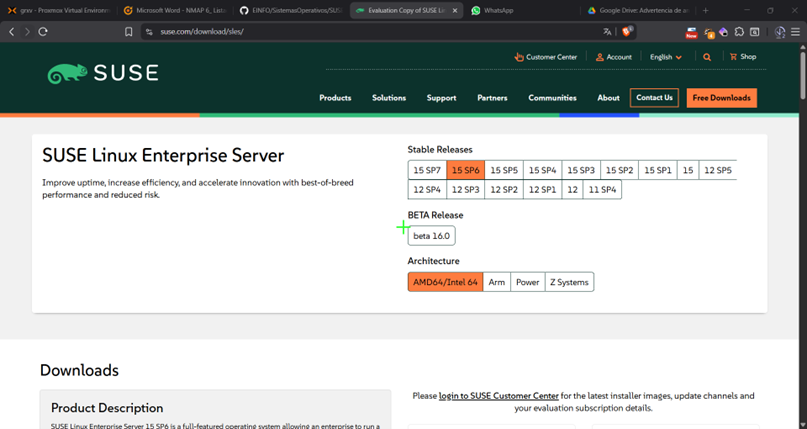
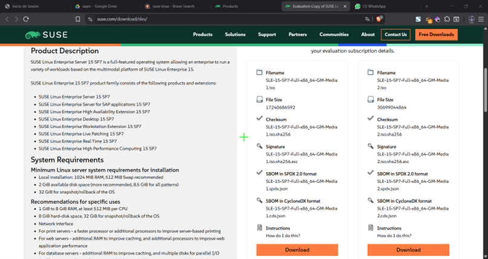
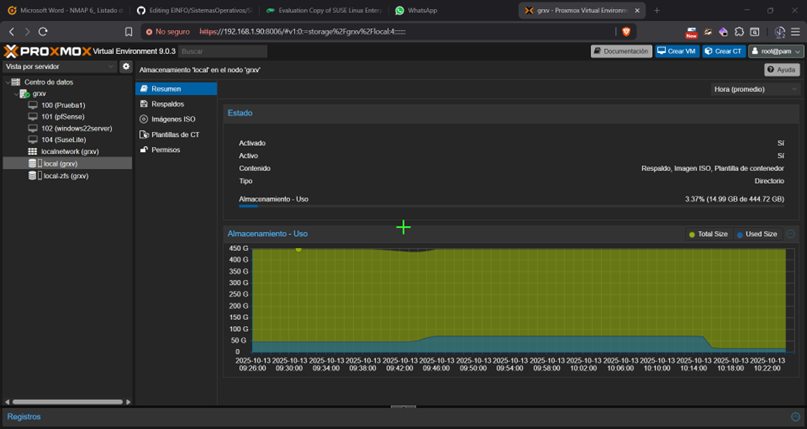
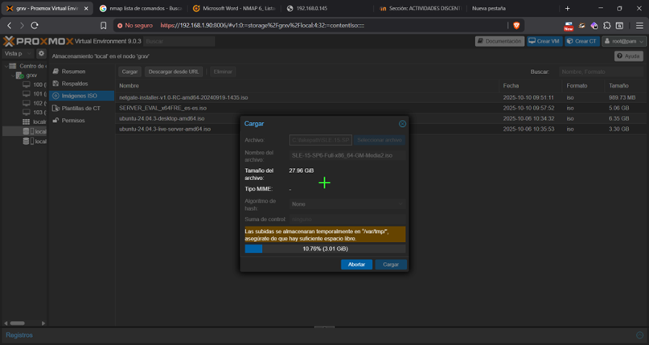

# Guía de Instalación del Sistema Operativo SUSE Linux Enterprise Server

**Versión del Documento:** 1.0
**Fecha de Última Modificación:** 2025-10-13

---

### **Resumen**

Este documento detalla el procedimiento técnico estandarizado para la instalación y configuración inicial del sistema operativo SUSE Linux Enterprise Server (SLES), versión 15 SP6. El objetivo es proporcionar una guía unívoca que garantice una implementación consistente y verificable. En caso de error puede dejar un mensaje. 

---

### **Índice**

1.  [Prerrequisitos](#1-prerrequisitos)
2.  [Preparación del Medio de Instalación](#2-preparación-del-medio-de-instalación)
3.  [Procedimiento de Instalación Detallado](#3-procedimiento-de-instalación-detallado)
    * [Fase 1: Arranque e Inicio](#fase-1-arranque-e-inicio)
    * [Fase 2: Configuración de Red y Registro](#fase-2-configuración-de-red-y-registro)
    * [Fase 3: Particionamiento de Disco](#fase-3-particionamiento-de-disco)
    * [Fase 4: Configuración Final](#fase-4-configuración-final)
4.  [Verificación Post-Instalación](#4-verificación-post-instalación)
5.  [Resolución de Problemas Comunes](#5-resolución-de-problemas-comunes)

---

### **1. Prerrequisitos**

#### **1.1. Requisitos de Hardware**

| Componente | Mínimo Requerido | Recomendado |
| :--- | :--- | :--- |
| **Procesador** | x86-64 a 1 GHz | Procesador de 2 núcleos o superior a 2.4 GHz |
| **Memoria RAM** | 1.5 GB | 4 GB o superior |
| **Espacio en Disco**| 10 GB | 40 GB o superior |
| **Resolución** | 800x600 | 1024x768 o superior |

#### **1.2. Requisitos de Software**

* Imagen ISO oficial de SUSE Linux Enterprise Server, obtenida desde [SUSE](https://www.suse.com/download/sles/).
* Para ello será necesario registrarnos para obtener una prueba gratuita de 60 días.
* .
* Elegimos nuestra versión deseada:
* .
* En este caso como va a ser instalada en una máquina virtual de nuestro servidor, lo primero que deberemos hacer es cargar el archivo ISO a nuestro servidor en PROXMOX.
* Entramos a nuestro servidor de Poxmox.
* .
* Cargamos el archivo ISO de forma local.
* .


---

### **2. Preparación del Medio de Instalación**

El medio de instalación se preparará utilizando una unidad USB de, como mínimo, 8 GB de capacidad.

1.  **Descargar** la imagen ISO oficial desde el portal de SUSE.
2.  **Verificar** la integridad del archivo descargado mediante su checksum SHA256.
    ```bash
    sha256sum sle-15-sp4-installer.iso
    ```
3.  **Grabar** la imagen ISO en la unidad USB utilizando la herramienta seleccionada.

---

### **3. Procedimiento de Instalación Detallado**

Siga los siguientes pasos de forma secuencial. Cada paso incluye una descripción y una captura de pantalla de referencia.

#### **Fase 1: Arranque e Inicio**

1.  **Conectar** el medio de instalación USB al equipo de destino y arrancar el sistema desde dicha unidad.
2.  En el menú de arranque, seleccionar la opción **"Installation"** y presionar `Enter`.

    

3.  **Seleccionar** el idioma, la distribución de teclado y aceptar los términos de la licencia.

    

*(... continúe detallando cada paso subsecuente de la misma manera)*

---

### **4. Verificación Post-Instalación**

Una vez finalizada la instalación y reiniciado el sistema, realice las siguientes comprobaciones para validar el éxito del proceso:

- [ ] El sistema arranca correctamente sin el medio de instalación.
- [ ] Se puede iniciar sesión con el usuario `root` y la contraseña definida.
- [ ] El sistema tiene conectividad a la red. Ejecutar `ping google.com`.
- [ ] Los repositorios del sistema están configurados y activos. Ejecutar `zypper repos -d`.

---

### **5. Resolución de Problemas Comunes**

| Problema | Causa Probable | Solución Propuesta |
| :--- | :--- | :--- |
| **El sistema no arranca desde el USB** | Configuración incorrecta del orden de arranque en la BIOS/UEFI. | Acceder a la configuración de la BIOS/UEFI y priorizar el arranque desde dispositivos USB. |
| **No se detecta el disco duro** | Falta de controladores de almacenamiento o disco dañado. | Verificar la conexión física del disco. Cargar controladores adicionales si es necesario desde el instalador. |
