# Crear subdominios con certificados válidos

## Introducción

Este documento detalla el procedimiento técnico para la configuración de un nuevo subdominio, abarcando desde la creación de su registro DNS correspondiente hasta la generación e implementación de un certificado SSL/TLS válido. El proceso utiliza Cloudflare para la gestión de DNS y el servicio ACME (en conjunción con HAProxy) en un firewall para la emisión de certificados y la gestión del tráfico (proxy reverso).

## 1. Configuración de Registros DNS en Cloudflare

El primer paso consiste en declarar el nuevo subdominio en el sistema de nombres de dominio (DNS).

1.  Acceder al panel de administración de Cloudflare.
2.  Navegar a la sección de **Registro DNS**.
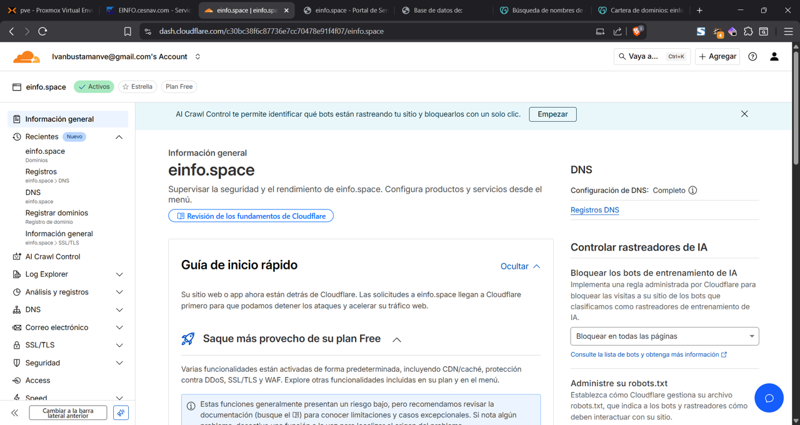 
3.  Seleccionar **"Agregar registro"**.
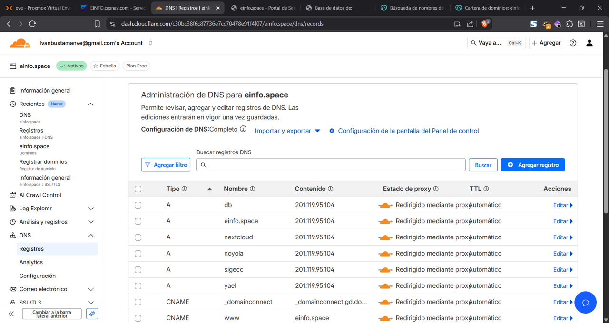
 
4.  Configurar los siguientes parámetros para el registro:
    * **Tipo:** `A`. Este tipo de registro asigna un nombre de dominio legible (el subdominio) a una dirección IPv4.
    * **Nombre:** El nombre específico del subdominio (`nextcloud.einfo.space`).
    * **Dirección IPv4:** La dirección IP pública del servidor de destino (el *endpoint* del firewall o balanceador).
5.  Confirmar y **Guardar** el nuevo registro DNS.

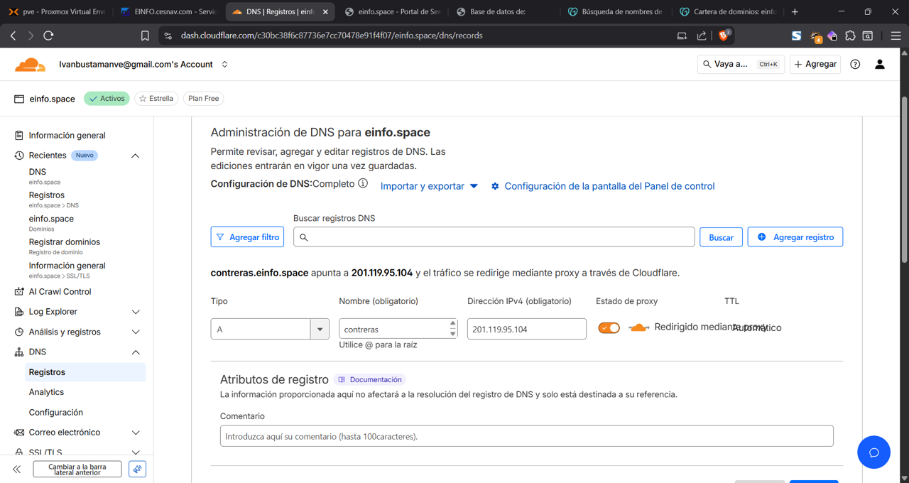 

## 2. Generación de Certificados SSL/TLS (ACME)

Para asegurar la conexión al subdominio, se debe generar un certificado SSL/TLS.

1.  Acceder a la interfaz de administración del firewall y navegar al módulo **"ACME Certificates"**.
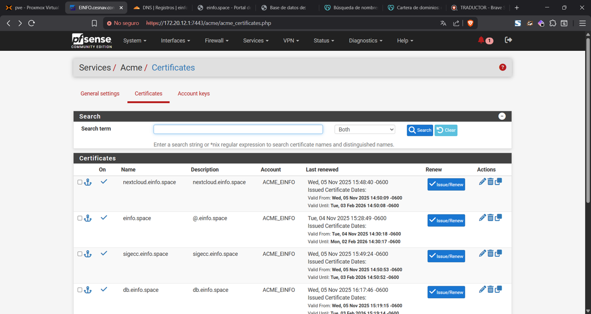

2.  Crear un nuevo certificado o editar uno existente para incluir el nuevo subdominio:
    * **Nombre y Descripción:** Asignar un identificador descriptivo (nombre del dominio) para una fácil identificación.
    * **Cuenta ACME:** Seleccionar la cuenta de ACME previamente configurada.
3.  Desplazarse a la sección **"Domain SAN list"** (Lista de Nombres Alternativos del Sujeto) y agregar un nuevo registro:
    * **Domainname:** Especificar el Nombre de Dominio Completo mas el nuevo subdominio (`nextcloud.einfo.com`).
    * **Método:** Seleccionar `DNS-Cloudflare`, indicando que la validación de propiedad del dominio se realizará automáticamente modificando los registros DNS en Cloudflare.
    * **Token (API Token):** Ingresar el token de API generado en Cloudflare (con permisos de edición de DNS).
    * **Zone ID:** Ingresar el ID de la zona DNS de Cloudflare corresponding al dominio.
4.  **Guardar** la configuración de la entrada SAN.

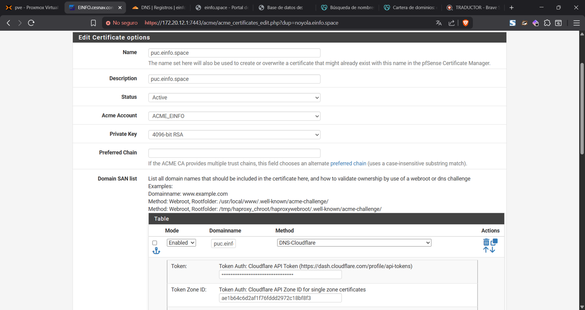

5.  Proceder con la solicitud del certificado seleccionando la opción **"Issue/Renew"** (Emitir/Renovar). El sistema ACME contactará a Let's Encrypt (u otro proveedor) y utilizará el token de Cloudflare para validar la propiedad del dominio.

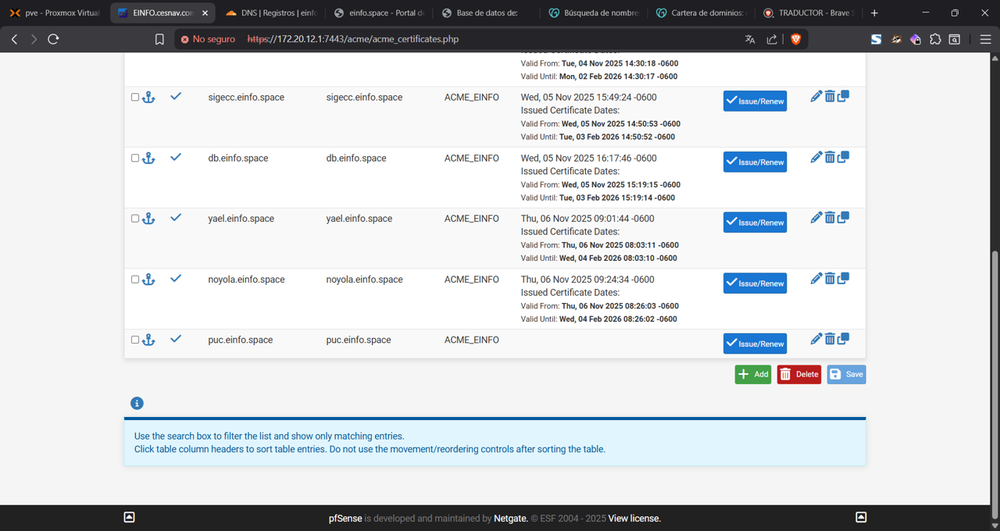 

## 3. Configuración de HAProxy (Proxy Reverso)

Una vez que el certificado está emitido, se configura HAProxy para dirigir el tráfico del subdominio al servidor interno correspondiente.

### 3.1. Definición del Backend

El *Backend* define el servidor o servicio interno al cual se reenviará el tráfico.

1.  Navegar a la sección de **HAProxy > Backend**.

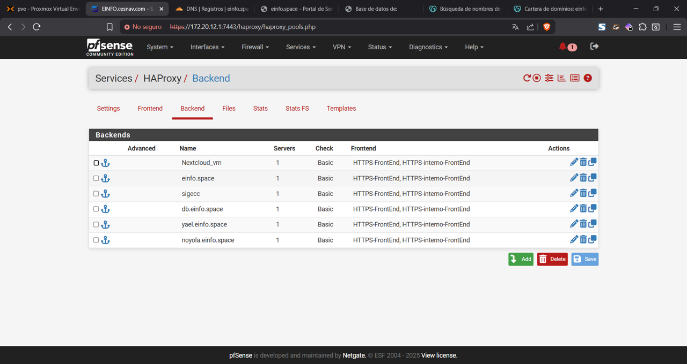

2.  Agregar un nuevo backend con la siguiente configuración:
    * **Nombre:** Asignar un nombre identificativo (preferentemente relacionado con el subdominio o servicio).
    * **Forward to:** Configurar el modo `Dirección + Puerto`.
    * **Server List:** Definir la dirección IP interna y el puerto (e.g., `172.20.13.102:8081`) de la máquina virtual (VM) o servidor que aloja la aplicación.
3.  **Guardar** la configuración del backend.

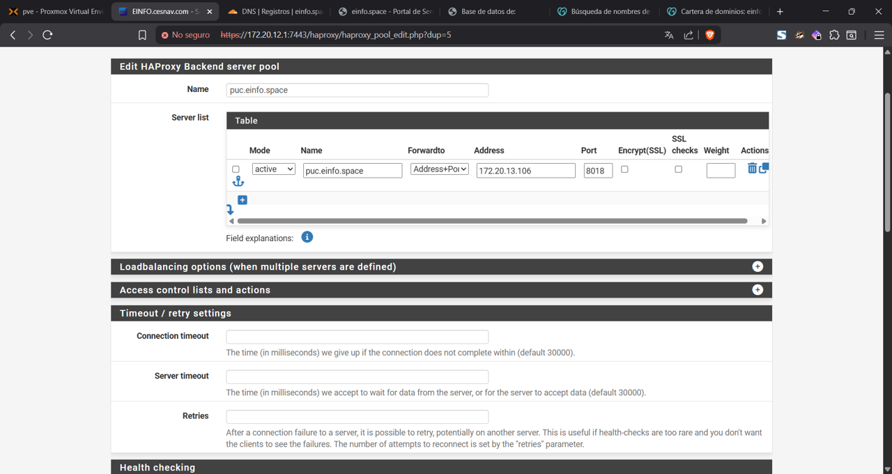

### 3.2. Definición del Frontend (Acceso Externo)

El *Frontend* gestiona las conexiones entrantes (públicas) y aplica las reglas de enrutamiento.

1.  Navegar a la sección de **HAProxy > Frontend** y agregar uno nuevo (o editar el existente de acceso público).
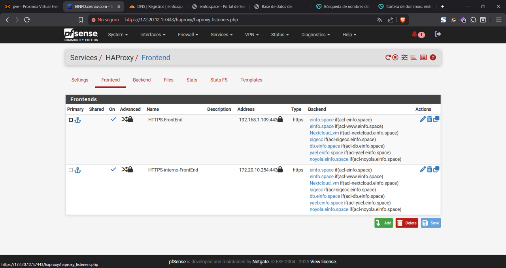
2.  Configurar los parámetros de escucha (Listen Address):
    * **External Address:** Seleccionar `WAN address (IPv4)`.
    * **Puerto:** `443` (puerto estándar para HTTPS).
    * **SSL Offloading:** Activar la casilla `SSL`. Esta acción, conocida como "descarga SSL", permite que HAProxy gestione el cifrado y descifrado de la conexión, enviando tráfico sin cifrar (HTTP) a los servidores internos, lo cual optimiza el rendimiento del backend.

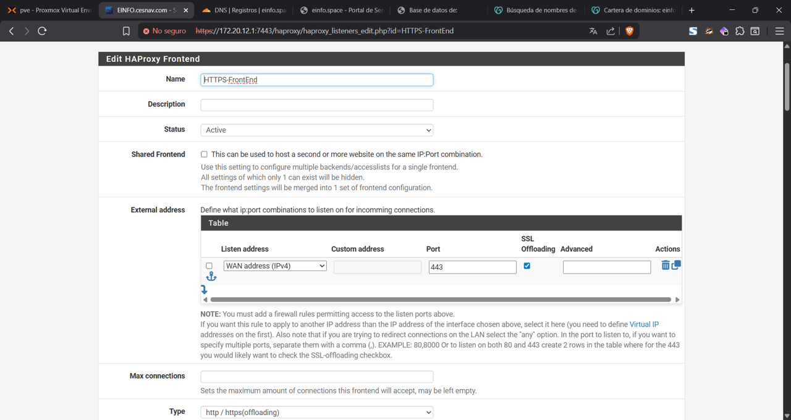

3.  Definir las **Listas de Control de Acceso (ACL)**:
    * Crear una nueva ACL que evalúe el encabezado del host solicitado. Por ejemplo: `Host matches: nextcloud.einfo.space`.

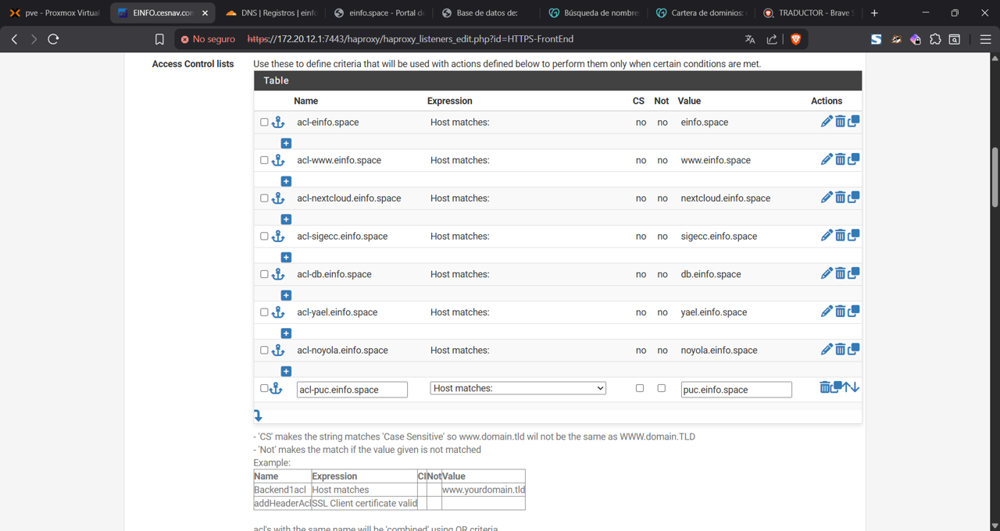

4.  Definir las **Acciones** basadas en la ACL:
    * Establecer una acción que dirija el tráfico que cumple la ACL (tráfico para `nextcloud.einfo.space`) al *Backend* correspondiente (`Use Backend`), seleccionando el backend creado en el paso

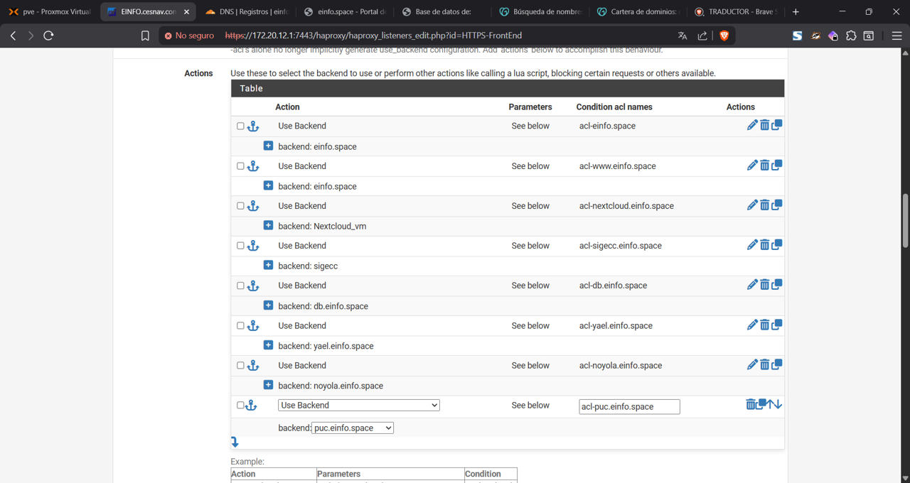   

3.1.
5.  En la sección **"Additional certificates"** (o similar, en el apartado de SSL Offloading), seleccionar el certificado ACME generado en el paso 2.5 que contiene el SAN del nuevo subdominio.
6.  **Guardar** y **Aplicar Cambios**.

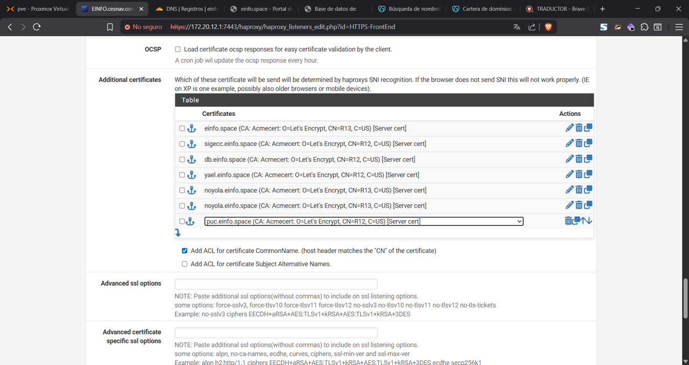 

### 3.3. Definición del Frontend (Acceso Interno) (Opcional)

Si se requiere que el subdominio también se resuelva correctamente desde la red interna (evitando *NAT Hairpinning*), se puede replicar la configuración del frontend en la interfaz interna.

1.  Crear un nuevo frontend.
2.  En **Listen Address**, seleccionar la interfaz de la red interna (`IF_MGNT`).
3.  Repetir la configuración de SSL Offloading, ACL, Acciones (backend) y asignación de certificado, análogamente al frontend externo (paso 3.2).

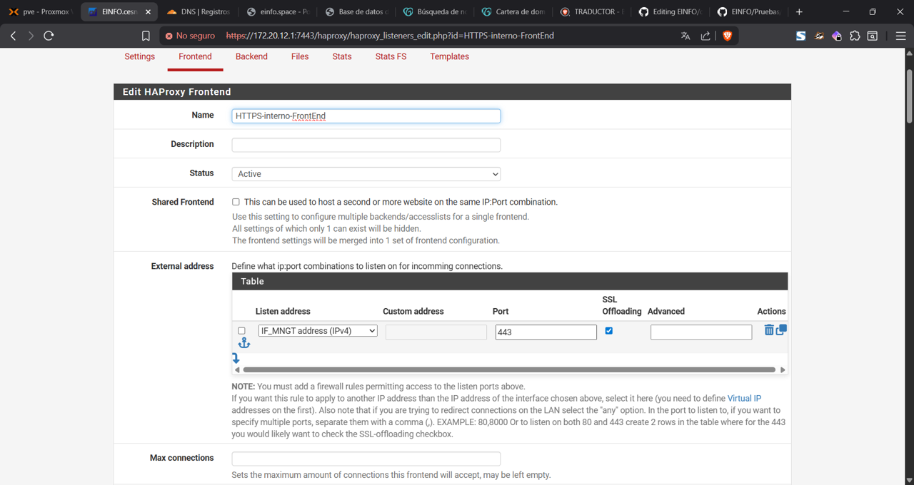 

## 4. Conclusión

El procedimiento ha finalizado. El subdominio es ahora accesible, el tráfico está siendo gestionado por HAProxy y la conexión está asegurada mediante un certificado SSL/TLS válido emitido por ACME.
